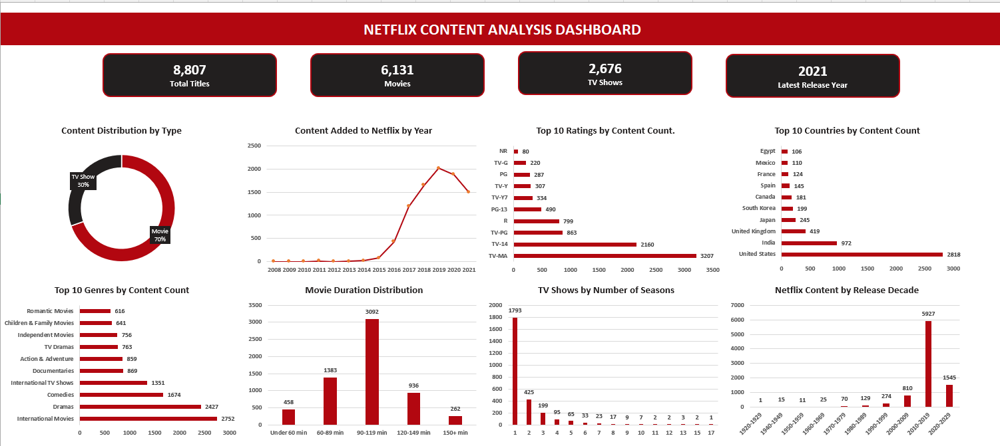
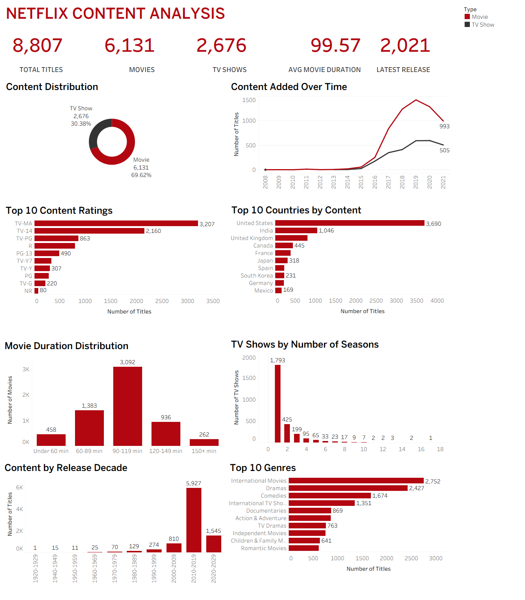

# Netflix Content Analysis

An end-to-end **Data Analytics portfolio project** analyzing Netflix movies and TV shows using **Microsoft Excel, MySQL, and Tableau**.

The project covers data cleaning, validation, transformation, SQL analysis, normalized country and genre analysis, dashboard development, and business insights.

## Project Overview

The dataset contains **8,807 Netflix titles** with information such as content type, title, director, cast, country, date added, release year, rating, duration, genre, and description.

### Key KPIs

| KPI | Value |
|---|---:|
| Total Titles | 8,807 |
| Movies | 6,131 |
| TV Shows | 2,676 |
| Average Movie Duration | 99.57 minutes |
| Latest Release Year | 2021 |

## Tools & Technologies

- **Microsoft Excel** — data cleaning, validation, helper columns, PivotTable analysis, charts, and dashboard development.
- **MySQL / MySQL Workbench** — database creation, CSV import, validation, data-type conversion, SQL analysis, and normalized helper tables.
- **Tableau Desktop** — live MySQL connection, data relationships, KPI cards, interactive filtering, and dashboard development.

## Project Workflow

### 1. Excel — Data Cleaning & Analysis

The dataset was first prepared and analyzed in Excel.

Main tasks included:

- Verified **8,807 records** and checked `show_id` uniqueness.
- Checked blanks and duplicates.
- Replaced missing Director, Cast, and Country values with `Unknown`.
- Retained the 10 missing `date_added` values as blanks.
- Corrected malformed Rating/Duration records.
- Created helper columns for:
  - Date Added Year
  - Date Added Month
  - Movie Duration in Minutes
  - TV Seasons
  - Movie Duration Group
- Normalized genres using Power Query.
- Created PivotTable-based analyses and business insights.
- Built a complete Excel dashboard.

## Excel Dashboard



## 2. MySQL — Database & SQL Analysis

The cleaned dataset was imported into the `netflix_content_analysis` MySQL database.

Main SQL work included:

- Imported all **8,807 cleaned records**.
- Validated record counts and duplicate Show IDs.
- Converted `date_added` into a proper SQL `DATE`.
- Validated content types, ratings, release years, movie durations, and TV seasons.
- Performed business analyses using filtering, aggregation, `GROUP BY`, `HAVING`, `CASE`, and related SQL techniques.
- Created normalized helper data for country and genre analysis.
- Connected the prepared MySQL model to Tableau.

## 3. Tableau — Interactive Dashboard

The final visualization layer was developed in Tableau using a live MySQL connection.

The dashboard contains:

- Total Titles
- Movies
- TV Shows
- Average Movie Duration
- Latest Release Year
- Content Distribution
- Content Added Over Time
- Top 10 Content Ratings
- Top 10 Countries by Content
- Movie Duration Distribution
- TV Shows by Number of Seasons
- Content by Release Decade
- Top 10 Genres

The **Content Distribution** visualization can be used to interactively explore Movies and TV Shows while the headline KPI cards continue to display the overall dataset totals.

## Tableau Dashboard



## Key Insights

- **Movies dominate the catalog**, with 6,131 titles compared with 2,676 TV Shows.
- Movies represent approximately **69.62%** of the dataset, while TV Shows represent **30.38%**.
- **TV-MA** is the most common content rating with **3,207 titles**.
- **International Movies** is the largest normalized genre with **2,752 titles**, followed by Dramas with **2,427**.
- After normalizing multi-country titles, the **United States** has the highest country association count at **3,690**, followed by India at **1,046**.
- The largest movie-duration group is **90–119 minutes**, containing **3,092 movies**.
- **1-season TV Shows** dominate the TV catalog with **1,793 titles**.
- The **2010–2019** release decade contains **5,927 titles**, making it the most represented decade.
- Netflix content additions increased strongly after 2015 and reached their highest level around 2019 in the analyzed data.

## Project Structure

```text
Netflix_Content_Analysis_Project/
│
├── 01_Raw_Data/
├── 02_Excel_Analysis/
├── 03_SQL_Analysis/
├── 04_Tableau/
├── 05_Screenshots/
│   ├── Netflix_Excel_Dashboard.png
│   └── Netflix_Tableau_Dashboard.png
│
└── 06_Project_Documentation/
    ├── README.md
    └── Netflix_Content_Analysis_Project_Report_v2.pdf
```

## Skills Demonstrated

**Excel:** Data Cleaning · Data Validation · Power Query · PivotTables · Charts · Dashboard Design

**SQL:** Data Import · Data Validation · Aggregations · GROUP BY · HAVING · CASE · Data Transformation · Normalization

**Tableau:** MySQL Connection · Data Relationships · KPI Cards · Interactive Dashboard · Filters · Data Visualization

## Conclusion

This project demonstrates a complete data analytics workflow from raw data preparation to database analysis and interactive visualization. Using Excel, MySQL, and Tableau together made it possible to validate the data across tools, analyze multi-value country and genre fields more accurately, and present the final findings in portfolio-ready dashboards.
